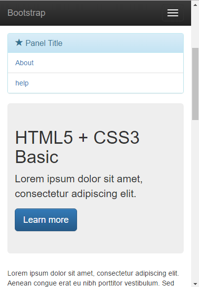
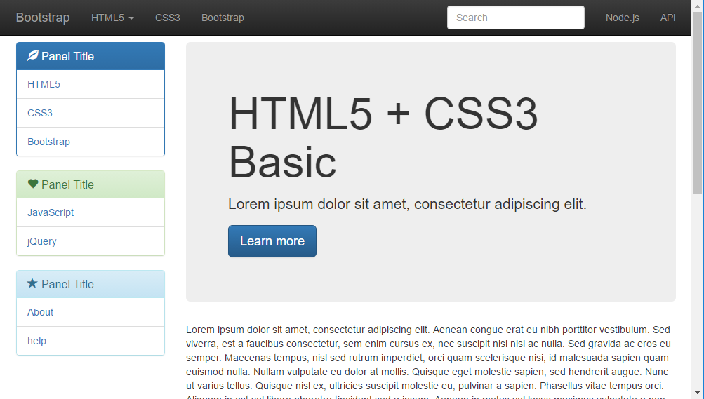
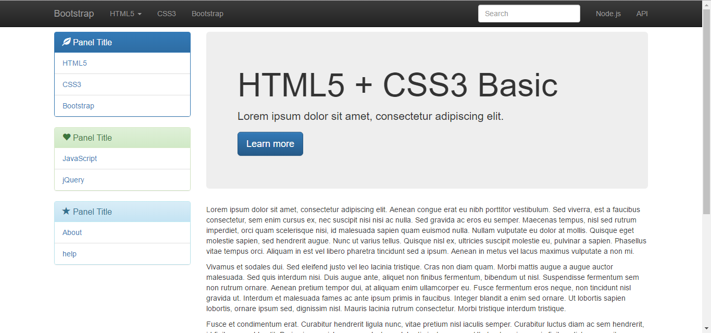

# Bootstrap_exercise

- 부트스트랩을 사용하여 반응형 웹 페이지 레이아웃 구성. 반응형 웹을 사용하므로 스마트폰 환경과 데스크톱 환경에서의 실행 결과가 다릅니다.
- 부트스트랩은 트위터에서 제공하는 웹 페이지 디자인 프레임워크이며, 반응형 웹 페이지 개발을 위한 HTML, CSS, JS 프레임워크입니다.

스마트폰 환경

테블릿 환경

데스크톱 환경
